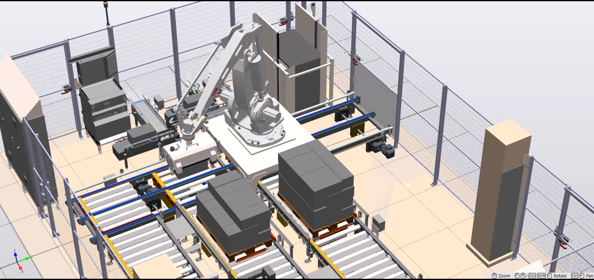

# 🤖 Robot Trajectory Optimization – University Project  

This project was carried out in collaboration with **ABB Polska** as part of a university course.  
The main goal was to design and optimize robot trajectories in **RobotStudio 2024** for palletizing scenarios.  

## 🎯 Project Goals  
- Implement **two palletizing scenarios** in RobotStudio  
- Design mechanisms for **package and spacer generation**  
- Optimize robot motion trajectories to **reduce energy consumption** and **shorten cycle times**  

## 📌 Results  
- ✅ Two palletizing scenarios successfully implemented  
- ✅ Package and spacer generation mechanisms designed  
- ⚡ Optimization completed for **one scenario** – reduced energy usage and cycle time  
- ⚠️ Second scenario optimization was not fully achieved due to time and software limitations  

## 🛠️ Tools & Resources  
- **RobotStudio 2024** (license provided by ABB)  
- Signal Analyzer for trajectory optimization  
- Simulation-based approach, no physical hardware required  

## 📷 Project Screenshots  
  
